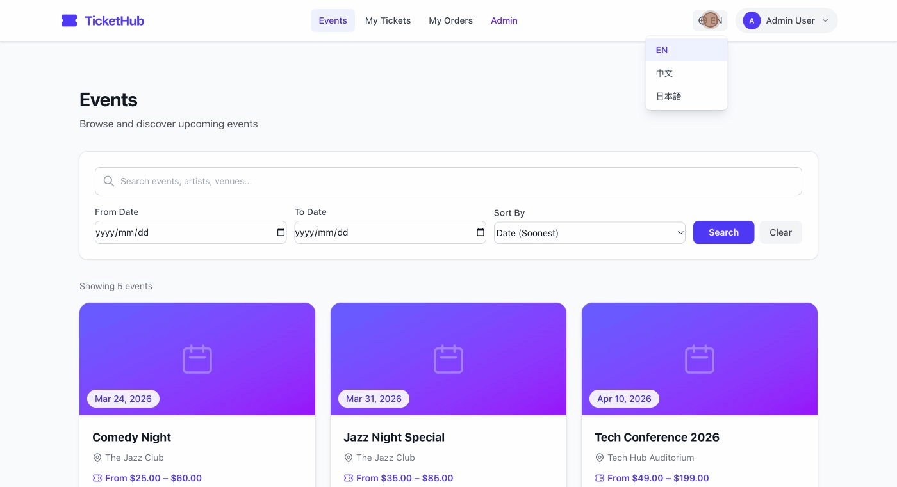
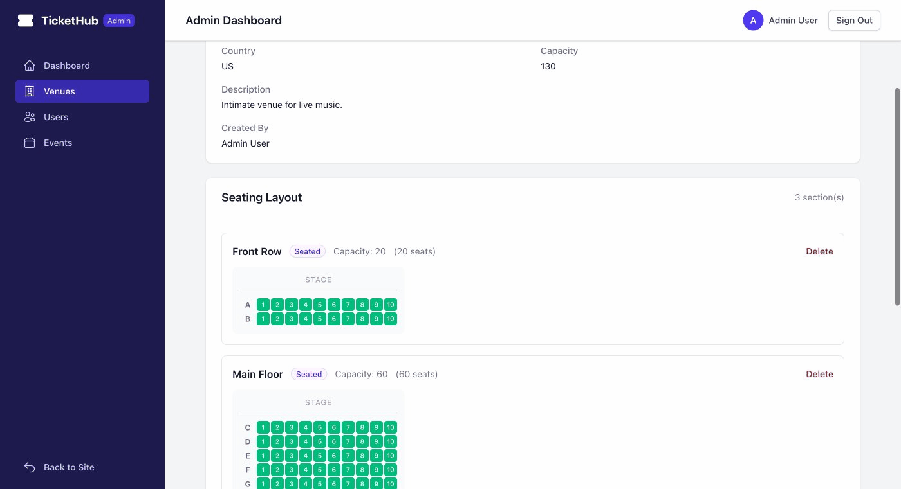
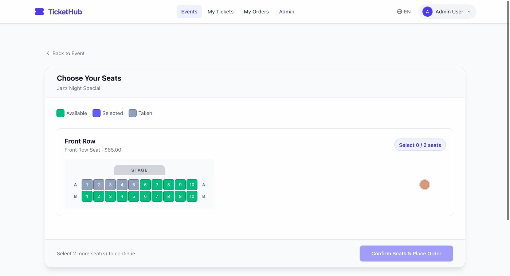
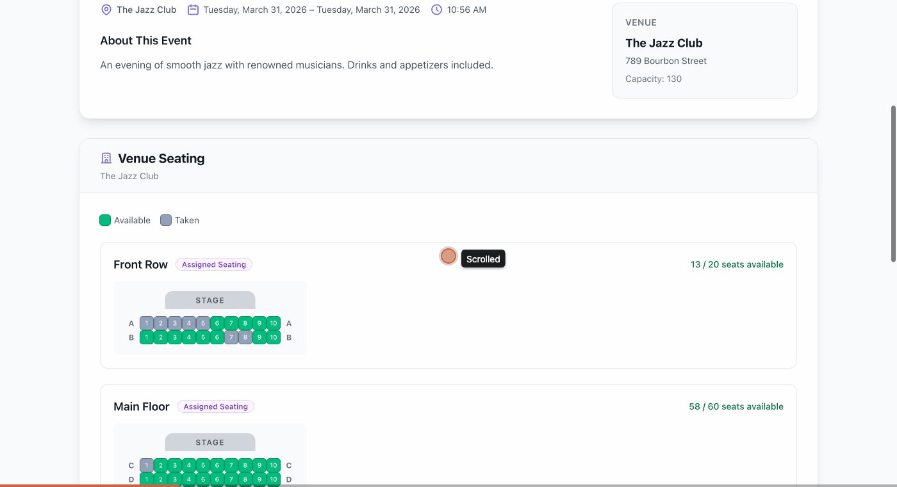

# TicketHub

A full-featured event ticketing platform built with **Rails 8.1** and **Tailwind CSS v4**. TicketHub supports event creation, venue management with configurable seating layouts, real-time seat selection with temporary holds, per-user purchase limits, a waiting room system, and full internationalization (English, Traditional Chinese, Japanese).

**Just a fun project to test the capability of Claude Code, everything is created by Claude, including this README.md**

## Screenshots

### Event Listings & Language Switcher

*Switch between English, 繁體中文, and 日本語 in one click — all UI text and date formats update instantly.*

### Venue Seating Layout (Admin)

*Admins configure multi-section venues with seated rows (e.g. Front Row 2x10, Main Floor 6x10) or General Admission areas.*

### Interactive Seat Picker (Buyer)

*Buyers pick individual seats in real time — available seats in green, selected seats in indigo, held seats in amber, taken seats in gray. Seats are temporarily held via Turbo Streams so other buyers see updates instantly.*

### Per-User Purchase Limit

*Admins set a per-user ticket limit for each event. The banner shows remaining allowance, and exceeding the limit triggers a clear error message.*

## Features

- **Event browsing & ticket purchasing** — Public event listings with cover images, media galleries, and multiple ticket types
- **Seat selection with real-time holds** — Interactive seat picker for venues with assigned seating; selected seats are temporarily held via Turbo Streams so other buyers see live availability
- **Per-user purchase limits** — Admins can set a maximum number of tickets each user can buy per event (across all orders), preventing bulk purchasing
- **Waiting room** — Redis-backed queue system that controls buyer flow during high-demand on-sales
- **Organizer dashboard** — Event creation/management, ticket type configuration, order tracking, and waiting room controls
- **Admin dashboard** — User management, venue/section/seat configuration, and platform-wide event oversight
- **Authentication & authorization** — Devise for authentication, Pundit for role-based access (attendee, organizer, admin)
- **Internationalization (i18n)** — Full support for English (`en`), Traditional Chinese (`zh-TW`), and Japanese (`ja`) with automatic browser language detection and a manual language switcher
- **File uploads** — Active Storage for event cover images and media galleries

## Tech Stack

| Layer | Technology |
|-------|-----------|
| Framework | Rails 8.1 |
| Ruby | 3.4.8 |
| Database | SQLite3 |
| CSS | Tailwind CSS v4 |
| JavaScript | Stimulus (via importmap) |
| Frontend | Hotwire (Turbo + Stimulus) |
| Auth | Devise |
| Authorization | Pundit |
| Pagination | Pagy |
| Queues/Cache | Solid Queue, Solid Cache, Solid Cable |
| Waiting Room | Redis |
| Asset Pipeline | Propshaft |

## Prerequisites

- **Ruby 3.4.8** (use [rbenv](https://github.com/rbenv/rbenv), [asdf](https://asdf-vm.com/), or [mise](https://mise.jdx.dev/))
- **SQLite3** (included on most systems)
- **Redis** (required for the waiting room feature)

## Installation

```bash
# Clone the repository
git clone <repository-url>
cd ticketing-website

# Install Ruby dependencies
bundle install

# Set up the database (create, migrate, seed)
bin/rails db:setup
```

The seed file creates default accounts you can use to explore the app:

| Role | Email | Password |
|------|-------|----------|
| Admin | `admin@tickethub.com` | `password123` |
| Organizer | `organizer@tickethub.com` | `password123` |
| Attendee | `attendant@tickethub.com` | `password123` |

## Starting the Service

### Development (recommended)

```bash
bin/dev
```

This starts the Rails server and the Tailwind CSS watcher concurrently via `Procfile.dev`.

### Rails server only

```bash
bin/rails server
```

Then visit **http://localhost:3000**.

### Redis (for waiting room)

Make sure Redis is running before using the waiting room feature:

```bash
# macOS (Homebrew)
brew services start redis

# Linux
sudo systemctl start redis

# Or run directly
redis-server
```

## Project Structure

```
app/
├── controllers/
│   ├── admin/          # Admin dashboard controllers
│   ├── organizer/      # Organizer dashboard controllers
│   ├── events_controller.rb
│   ├── orders_controller.rb
│   ├── tickets_controller.rb
│   ├── waiting_rooms_controller.rb
│   └── locale_controller.rb
├── views/
│   ├── layouts/        # Application, admin, and organizer layouts
│   ├── shared/         # Navbar, flash messages, media components
│   ├── devise/         # Authentication views
│   └── ...
├── javascript/
│   └── controllers/    # Stimulus controllers (seat picker, dropdown, etc.)
├── models/
│   ├── user.rb         # Roles: attendee, organizer, admin
│   ├── event.rb        # Events with purchase limits and seat selection modes
│   ├── venue.rb
│   ├── section.rb      # General admission or seated
│   ├── seat.rb
│   ├── seat_hold.rb    # Temporary seat reservations with Turbo broadcasts
│   ├── order.rb
│   ├── ticket.rb
│   └── waiting_room_entry.rb
└── policies/           # Pundit authorization policies

config/
└── locales/
    ├── en.yml          # English translations
    ├── zh-TW.yml       # Traditional Chinese translations
    ├── ja.yml          # Japanese translations
    ├── devise.zh-TW.yml
    └── devise.ja.yml
```

## Internationalization

The app automatically detects the user's preferred language from the browser `Accept-Language` header. Users can also switch languages manually via the language dropdown in the navbar. The selected language is stored in a cookie for 1 year.

Supported locales: **English**, **繁體中文 (Traditional Chinese)**, **日本語 (Japanese)**

## License

This project is for educational and demonstration purposes.
